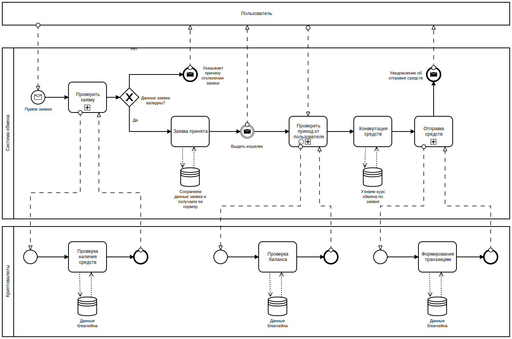

## Домашнее задание №3 «"Как это выглядит?" или как нарисовать процесс»

Создание модели процесса по своему курсовому проекту в нотации BPMN

**Цель:** Научиться создавать графическое отображение модели бизнес-процесса

0. Определить для себя value (ценность) вашего курсового проекта и желаемый уровень детализации.
1. Сделать текстовое описание процесса по своему курсовому проекту. Текстовое описание процесса должно содержать набор ролей в процессе, описание действия (краткое), описание имеющихся ограничений и взаимодействий. В идеале по вашему текстовому описанию другой программист может начать что-то имплементировать. Допустимо, что текстовое описание будет напоминать черновик для подготовки в созданию диаграммы.
2. Нарисовать диаграмму BPMN (диаграмму коллаборации) по своему процессу. Диаграмма должна соответствовать текстовому описанию из первого пункта.

### Критерии оценки: По полноте описания процесса:
1. 1 балл за текстовое описание процесса
2. 1 балл за графическое описание процесса в нотации BMPN
3. 1 балл за верное использование элементов нотации BMPN
4. 1 балл за логически правильно описание процесса

---

### Ценность курсовой работы
Создать систему обмена криптовалют.

### Текстовое описание
Нужна система обмена криптовалют, у которого будет иметься запас некоторых криптовалют. Любой пользователь может создать заявку обмена своей криптовалюты на любую другую, что имеется в системе. Если указанные в заявке первичные данные проходят проверку, то заявка принимается в обработку, либо отклоняется с указанием причины. Когда заявка принята от пользователя, то по ней пользователю выдается номер криптовалютного кошелька системы, куда он должен отправить свои средства для совершения обмена. Обмен будет происходить мгновенно по курсу заявки, за вычетом комиссии системы обмена, при условии что система дождалась от пользователя отправленные им средства. Все данные по принятой заявке должны храниться в базе

### BPMN диаграмма

