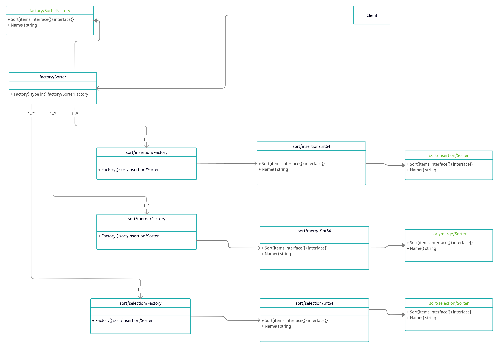

## Домашнее задание №4 «Фабричный метод и абстрактная фабрика»

Реализация выбора подходящего метода сортировки (выбором, вставки, слиянием) набора данных с использованием абстрактной фабрики и описание применения шаблона в проекте

**Цель:** Получите навык работы с абстрактной фабрикой.

Данные задаются в файле. Результат также помещается в файл.

1. Выбрать массив размером 50 элементов.
2. Создать программу, которая в качестве входного параметра получает вариант сортировки (выбором, вставки, слиянием), имя файла со входным набором данных и имя файла с выходными данными.
3. Реализовать в программе абстрактную фабрику и конкретные фабрики, отвечающие за каждый вариант сортировки как продукты.
4. Программа записывает результаты в выходной файл данных. В содержании в пишется тип сортировки и результаты.
5. Если потребуется использовать абстрактную фабрику или фабричный метод в проектной работе, предоставить описание в текстовом файле в GitHub репозитории где конкретно и в какой роли используется этот шаблон.
6. нарисовать диаграмму классов.

ДЗ сдается в виде ссылки на GitHub репозиторий с проектом.

По вопросам обращаться в Slack к студентам, преподавателям и наставникам в канал группы

### Критерии оценки: Критерии оценки:
1. Прислано решение: 1 балл
2. Описаны все объекты , программа работает - 1 балл.
3. Разработан тест - 1 балл

Минимальный балл для принятия - 2

---

### Использование в проектной работе
В своей проектной работе я буду использовать фабричный метод для определения типа коннектора к блокчейн системе.

### Диаграмма классов

