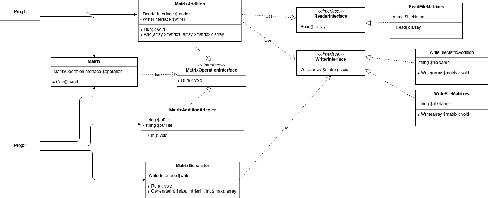

## Домашнее задание №5 «Адаптер и мост»

Адаптер для работы двух независимых программ. Описание применения шаблона в проекте

**Цель:**
1. Вы напишете адаптер, чтобы связать функционал двух отдельных программ в единый процесс. разберётесь с тем, как адаптер работает в случае вызова отдельных программ. Получите навыки работы с формальными и фактическими параметрами передачи данных
2. Получите навык анализа системы - использовать или нет этот шаблон в проектной работе.

Написать простую консольную программу П1, с интерфейсом вызова И1, которая читает данные о двух матрицах А и В из файла F0, складывает матрицы и сохраняет результат А+В в другой файл F1.
Написать вторую консольную программу П2, которая может генерить данные матриц А и В и писать их в файл с именем F2.
Чтобы она могла их просуммировать, следует сделать адаптер для программы П1, который позволит программе П2 вызвать П1.

1. Написать программу П1
2. Написать программу П2, включив туда адаптер вызова и использования программы П1
3. Написать автотест для проверки функционирования
4. Если потребуется использовать адаптер в проектной работе, предоставить описание в текстовом файле в GitHub репозитории где конкретно и в какой роли используется этот шаблон.
5. нарисовать диаграмму классов.

ДЗ сдается в виде ссылки на GitHub репозиторий с проектом.

По вопросам обращаться в Slack к преподавателям и наставникам в канал группы

### Критерии оценки: Критерии оценки:
1. Прислано решение: 1 балл
2. Описаны все объекты , программа работает - 1 балл.
3. Разработан тест - 1 балл

Минимальный балл для принятия - 2

---

### Разворачивание проекта
В проекте реализованы две программы:
- ./prog1.php - программа 1, которая читает данные о двух матрицах А и В из файла F0, складывает матрицы и сохраняет результат А+В в другой файл F1
- ./prog2.php - программа 2, которая генерит данные матриц А и В и писать их в файл с именем F2 и вызывает программу 1 для сложения матриц

Необходимо глобально установить PHP 7.4.

Выполнить загрузку зависимостей:
    ``php composer.phar install``

Запустить прогон юнит-тестов:
    ``php vendor/bin/codecept run unit``

#### Программа 1
Запускать программу 1 нужно следующим образом:
    ``php ./prog1.php F0.txt F1.txt``

Где:
- ``F0.txt`` - входной csv-файл с данными матриц A и B 
- ``F1.txt`` - выходной csv-файл с результатом сложения матриц А+В

В корне проекта уже имеется пример входного csv-файла - ``F0.txt``

Примеры запуска проекта из консоли:
    ``php ./prog1.php F0.txt F1.txt``

#### Программа 2
Запускать программу 2 нужно следующим образом:
    ``php ./prog2.php F2.txt F1.txt``

Где:
- ``F2.txt`` - выходной csv-файл с нагеренренными данными матриц A и B
- ``F1.txt`` - выходной csv-файл с результатом сложения матриц А+В

Примеры запуска проекта из консоли:
    ``php ./prog2.php F2.txt F1.txt``

### Использование в проектной работе
Использовать адаптера в проекте явном виде не планируется, он может быть использован во фреймворке Yii2 в неявном виде. 

### Диаграмма классов

