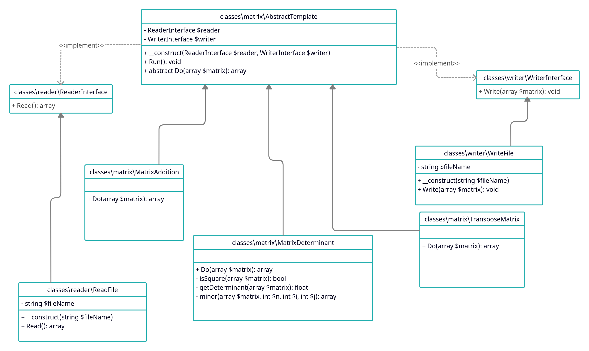

## Домашнее задание №6 «Шаблонный метод»

Реализация выбора подходящего метода матричных операций с применением шаблонного метода и описание применения шаблона в проекте

**Цель:** Получите навыки в программировании алгоритмов матричных операций, применении шаблонного метода.

Есть несколько операций над матрицами:
1. транспонирование матрицы
2. сложение матриц
3. найти определитель матрицы

Написать программу, которая выполняет следующее:
1. на входе получает название входного файла, выходного файла и вид операции
2. Получает данные из файла
3. Выполняет указанную операцию над данными
4. Формирует данные для вывода в необходимом формате
5. Записывает данные в выходной файл
6. Если потребуется использовать Шаблонный метод в проектной работе, предоставить описание в текстовом файле в GitHub репозитории где конкретно и в какой роли используется этот шаблон.
7. нарисовать диаграмму классов.

ДЗ сдается в виде ссылки на GitHub репозиторий с проектом.

По вопросам обращаться в Slack к студентам, преподавателям и наставникам в канал группы

### Критерии оценки: Критерии оценки:
1. Прислано решение: 1 балл
2. Описаны все объекты , программа работает - 1 балл.
3. Разработан тест - 1 балл

Минимальный балл для принятия - 2

---

### Разворачивание проекта
Необходимо глобально установить PHP 7.4 и пакетный менеджер composer (https://getcomposer.org/).

Выполнить загрузку зависимостей:
    ``composer install``

Запустить прогон юнит-тестов:
    ``php vendor/bin/codecept run unit``

Запускать проект нужно следующим образом:
    ``php ./index.php <in_file> <out_file> <operation>``

Где:
- ``<in_file>`` - входной csv-файл с данными матрицы 
- ``<out_file>`` - выходной csv-файл с результатом выполнения проекта
- ``<operation>`` - тип операции

Типы операций:
- transpose - транспонирование матрицы
- addition - сложение матриц
- determinant - найти определитель матрицы

В корне проекта уже имеется пример входного csv-файла - ``in_file.txt``

Примеры запуска проекта из консоли:
``php ./index.php in_file.txt out_file.txt transpose``

### Использование в проектной работе
Использовать шаблонный метод в проекте явном виде не планируется, он может быть использован во фреймворке Yii2 в неявном виде. 

### Диаграмма классов

