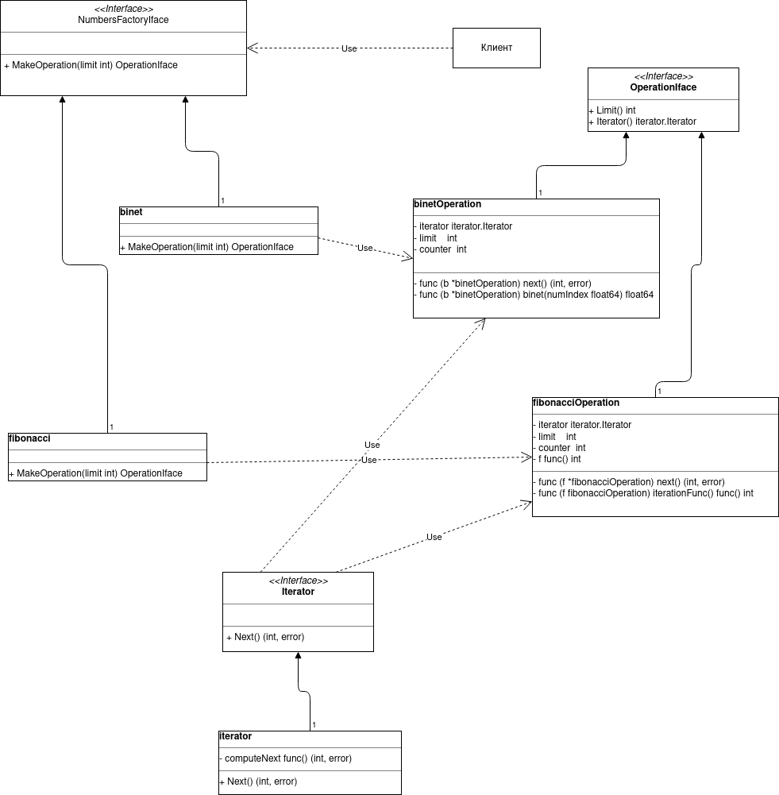

## Домашнее задание №7 «Итератор»

Генератор чисел Фибоначчи и описание применения шаблона в проекте

**Цель:** Получите навыки применения шаблона "итератор" и знания формировании чисел Фибонначи

Написать программу, которая выполняет следующее:
1. Создать программу, которая генерит числа фибонначи в указанном диапазоне в указанный файл. Предусмотреть возможность движения в обратном направлении (например, с использованием формулы Binet)
2. Реализовать в программе абстрактную фабрику и конкретные фабрики, отвечающие за каждый вариант сортировки как продукты.
3. Программа записывает результаты в выходной файл данных.
4. Если потребуется использовать Итератор в проектной работе, предоставить описание в текстовом файле в GitHub репозитории где конкретно и в какой роли используется этот шаблон.
5. нарисовать диаграмму классов.

ДЗ сдается в виде ссылки на GitHub репозиторий с проектом.

По вопросам обращаться в Slack к студентам, преподавателям и наставникам в канал группы

### Критерии оценки: Критерии оценки:
1. Прислано своевременно решение: 1 балл
2. Описаны все объекты , программа работает - 1 балл.
3. Разработан тест - 1 балл

Минимальный балл для принятия - 2

---

### Использование в проектной работе
В проектной работе использование не планируется.

### Диаграмма классов

