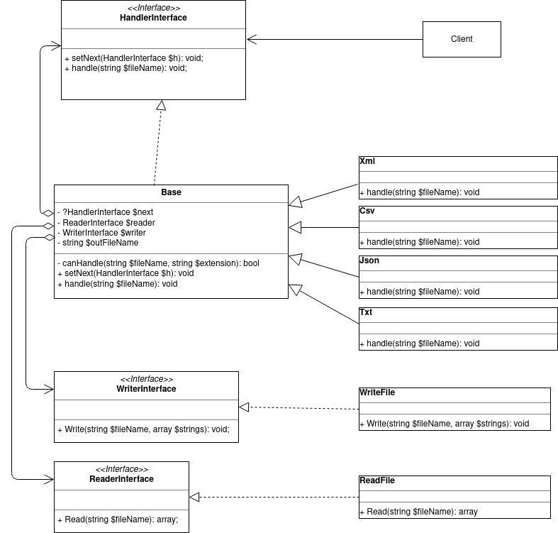

## Домашнее задание №8 «Цепочка обязанностей»

Парсер файлов в зависимости от их типа и описание применения шаблона в проекте

**Цель:** Получите навыки применения шаблона "цепочка ответственности"

На вход алгоритма передаётся ряд файлов, которые имеют различный тип (Xml, JSON, CSV, txt)

Требуется создать цепочку обработки этих файлов, где отдельный обработчик отвечает за обработку конкретного типа документа.
Обработчик логирует получение подходящего ему файла в виде "обработчик TXT получил файл filename.txt" и копирует содержимое в выходной файл.

Требуется:
1. создать программу, где на вход подаётся путь файла со списком обрабатываемых файлов и путь выходного файла.
2. реализовать алгоритм обработки с помощью шаблона "Цепочка ответственности"
3. нарисовать диаграмму классов.

Если потребуется использовать шаблон в проектной работе, предоставить описание в текстовом файле в GitHub репозитории где конкретно и в какой роли используется этот шаблон.

ДЗ сдается в виде ссылки на GitHub репозиторий с проектом.

По вопросам обращаться в Slack к студентам, преподавателям и наставникам в канал группы

### Критерии оценки: Критерии оценки:
1. Прислано решение: 1 балл
2. Описаны все объекты , программа работает - 1 балл.
3. Разработан тест - 1 балл

Минимальный балл для принятия - 2

---

### Разворачивание проекта
Необходимо глобально установить PHP 7.4 и пакетный менеджер composer (https://getcomposer.org/).

Выполнить загрузку зависимостей:
    ``php composer.phar install``

Запустить прогон юнит-тестов:
    ``php vendor/bin/codecept run unit``

Запускать проект нужно следующим образом:
    ``php ./index.php <in_file> <out_file>``

Где:
- ``<in_file>`` - входной csv-файл с данными матрицы 
- ``<out_file>`` - выходной csv-файл с результатом выполнения проекта

В корне проекта уже имеется пример входного csv-файла - ``in_file.txt``

Примеры запуска проекта из консоли:
``php ./index.php in_file.txt out_file.txt``

### Использование в проектной работе
Использовать шаблонный в проекте явном виде не планируется, он может быть использован во фреймворке Yii2 в неявном виде. 

### Диаграмма классов

